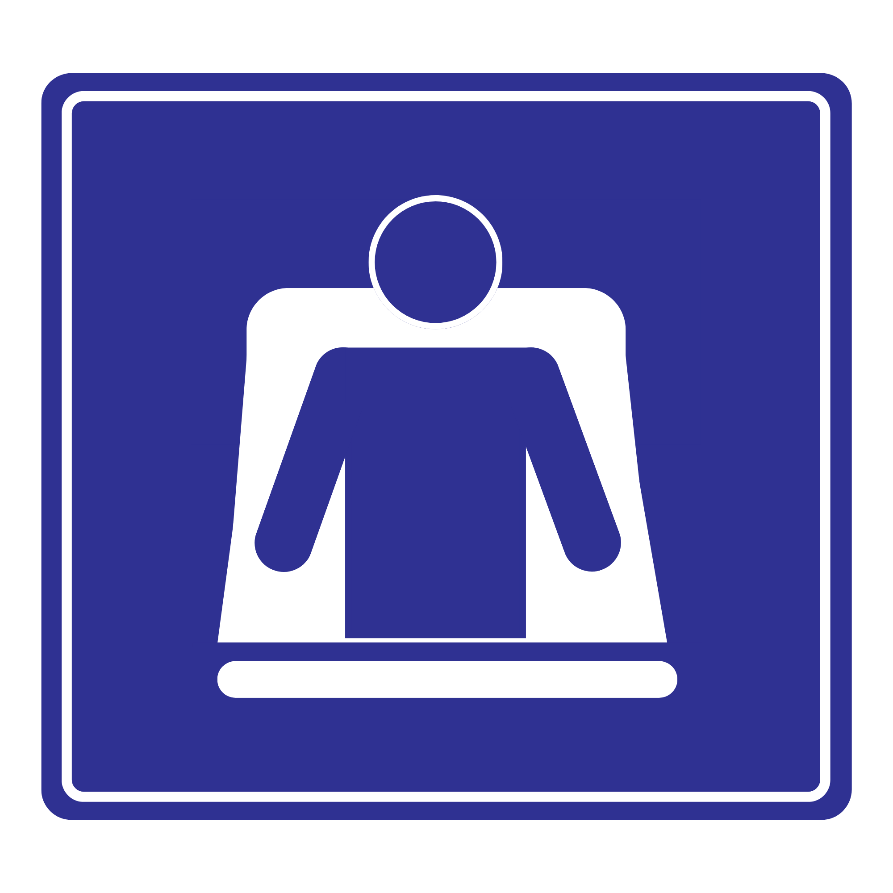

   
  <b>Priorizah: Sistema de sensores para assentos preferenciais</b> 
  <text>🚈 Relatório do projeto</text>

 

## 📍Introdução

O projeto de cartões de identificação, desenvolvido na disciplina de [CFA](https://github.com/FNakano/CFA), tem como objetivo desenvolver um projeto utilizando a tecnologia de NFC para realizar avisos sonoros e alertar os passageiros do vagão. Para ver outros projetos relacionados que utilizam NFC, utilizamos como inspiração o projeto [CardForRPG](https://github.com/Felipe256/CardForRPG) e o projeto [SMAC - Sistema de Monitoramento para Assentos de Cadeira de Roda](https://github.com/Anemaygi/SMAC/tree/master/projeto) que apresenta uma possibilidade de implementação para os sensores de toque detectarem presença em um assento.

### 🗺️ Aplicação Real

A iniciativa foi inspirada no sistema de sensores utilizado no metrô da Coreia do Sul e seu aplicativo [pinklight](https://play.google.com/store/apps/details?id=kr.doweb.pinklight&hl=pt_BR), para criar uma solução baseada em IoT que incentive os passageiros a dar lugar à mulheres grávidas no assento preferencial. Segundo o [estudo de caso](https://publicadministration.un.org/unpsa/en/Home/Case-Details-Public?PreScreeningGUID=399fae3c-5002-4a93-af5e-88691160b86c&ReadOnly=Yes), "Recentemente, como muitos passageiros ficam absortos em seus smartphones enquanto viajam de ônibus ou metrô, é possível que raramente notem uma gestante por perto. Partindo do princípio de que muitos dos passageiros que não estão grávidos, mas ocupam assentos preferenciais, estariam de fato dispostos a ceder o lugar a uma mulher caso percebessem que ela está grávida, a cidade de Busan lançou o 'Pink Light'".

Assim, o dispositivo seria uma forma de alertar os passageiros quando devem ceder seu lugar para outro passageiro, sem necessidade de perguntar e sem que seja necessário pedir. É uma tecnologia relativamente barata de ser implementada como política pública que incentiva o bem-estar de diferentes grupos sociais com direito ao assento preferencial, como por exemplo: Pessoas com deficiência, pessoas com crianças de colo, idosos, obesos, gestantes, pessoas com restrição de mobilidade e autistas.

## 🗂️ Organização do repositório e primeiros passos:

## 👩‍🦯‍➡️ História de usuário (exemplificação de como funcionaria o projeto):

### usuário com direito ao assento preferencial

 1. ao entrar no trem o usuario deve ter em mãos o acessorio (cartão ou chaveiro) que tem informações sobre o assento preferencial
 2. o usuário deve encostar o acessório no dispositivo no sensor de nfc (requisito esse estar localizado com fácil acesso)
 3. o usuário verá a luz acima dos assentos liberados acender
     3.5 Se não houverem assentos livres, os passageiros ouviram o anuncio da chegada do passageiro preferencial e necessidade de liberação de assentos preferenciais
 4. o usuário pode ir até o assento, necessitando possivelmente que outros passageiros deem lugar sabendo da presença do passageiro preferencial

### usuários sem acesso ao assento preferencial

 1. ao chegar no trem, se houver um assento vazio e nao houver pessoas preferenciais usuário pode se sentar no assento preferencial
 2. o usuário fica tranquilo e quando chega na proxima estação se houver um usuario que deseja usar o assento preferencial ele ouve um anúncio
 3. o usuario deve se levantar, permitindo que a luz de assento livre ligue
 4. o usuario com direito ao assento verá o assento livre e se sentará nele

### preocupação com funcionalidade

- importante reforçar que a implementação do projeto envolve também a mudança no comportamento do usuário. Se implementado na vida real, o sucesso do projeto depende das pessoas cederem seus assentos. 

- O projeto em suas primeiras versões tem impedimentos para seu funcionamento em horários de pico. Os motivos são 
1. limitação no número de assentos
2. Possível lotação pode impedir o usuário de chegar ate o sensor do cartão. A lotação tambem pode impedir o usuário de enxergar a luz que sinaliza o assento livre, bem como impedir o deslocamento do usuario até lá.

## ⚙️ Como foi feito o projeto:

### 🔧 Componentes:
O projeto utiliza:
- 3 ESP32-C3 mini
- 1 PN532
- 1 Buzzer
- 4 Módulo sensor de toque capacitivo TTP223B
- 2 LED
- 2 Protoboard
- N Jumper
- PC ou outro dispositivo para atuar como servidor

**código em micropython e comunicação via TCP/IP com necessidade de os ESP32 e o Servidor se conectarem em mesma rede**

## Documentação do Código:

### Estrutura do Projeto:
O projeto está organizado em três blocos principais, cada um com uma função bem definida no funcionamento do sistema:
- Módulo de leitura NFC: localizado em 'esp_comunicando.py' e 'nfc_buzzer.py'. Esse módulo é responsável por interagir com o leitor PN532, ler o UID de cartões ou chaveiros NFC e identificar se o identificador corresponde a um usuário autorizado, além da comunicação com o servidor. Também há uma camada de inicialização em 'start.py', que chama o fluxo principal do leitor.
- Módulo de assentos: implementado em 'sensor_v1.py' e 'seat_state.py'. Aqui ficam os sensores de toque capacitivo, o LED de indicação e a lógica de estado do assento. O código decide se o assento está ocupado ou disponível e controla se o LED deve permanecer aceso ou apagado.
- Servidor central: implementado em 'pc_server.py'. Esse componente funciona como cérebro do sistema. Ele recebe mensagens dos ESPs, mantém um registro dos assentos conectados, consulta o estado deles e decide qual assento deve receber o sinal de indicação após um evento NFC.

**A organização do repositório segue essa divisão: uma pasta para o ESP de NFC, outra para o ESP dos assentos e outra para o servidor. Além disso, há arquivos de configuração local, como esp_config.py, que definem Wi-Fi, IP do servidor e parâmetros específicos de cada dispositivo.**

### Responsabilidade de cada ESP32:
O projeto utiliza dois ESP32 com papéis distintos:

ESP32 do leitor NFC: é o dispositivo responsável por detectar a presença de um cartão ou chaveiro próximo ao leitor PN532. Quando um cartão é lido, ele verifica se o UID está na lista de identificadores autorizados. Se for um usuário válido, ele envia uma mensagem para o servidor informando que um evento NFC ocorreu. Também pode acionar um buzzer para fornecer feedback sonoro ao usuário.

ESP32 dos assentos: é o dispositivo ligado fisicamente ao assento. Ele monitora dois sensores de toque capacitivo para verificar se alguém está sentado.
Mantém um estado interno do assento, usando uma janela de leituras para evitar flutuações momentâneas. Controla um LED que indica visualmente se o assento está livre ou foi selecionado para um passageiro preferencial. Responde a comandos vindos do servidor, como consultar status do assento ou acender/apagar o LED.

OBS: nesse projeto foi utilizado 3 ESP32, 1 leitor NFC e 2 dos assentos.

### Fluxo de comunicação entre os dispositivos
A comunicação entre os dispositivos é feita via TCP/IP, usando mensagens em formato JSON. O fluxo principal funciona assim:

- Inicialização:
  - Cada ESP32 conecta-se à rede Wi-Fi configurada;
  - O ESP32 dos assentos se conecta ao servidor e envia um registro com seu identificador de assento;
  - O servidor armazena essa conexão e passa a considerar aquele assento disponível para futuras decisões;

- Leitura do NFC.
  - O ESP32 de NFC lê o UID do cartão aproximado ao leitor.
  - Se o UID estiver autorizado, ele envia uma mensagem ao servidor, indicando que um passageiro preferencial foi detectado.

- Decisão do servidor
  - O servidor recebe a mensagem do NFC e procura entre os assentos registrados aquele que está disponível.
  - Para isso, ele consulta cada assento e verifica se ele está livre.
Quando encontra um assento adequado, envia um comando para acender o LED desse assento.

- Atualização do estado do assento
  - O ESP32 do assento recebe o comando e atualiza seu estado interno.
  - Enquanto a pessoa permanece sentada, os sensores capacitivos continuam detectando ocupação e o LED é desligado quando o assento passa a ser considerado ocupado.
  - O servidor pode então continuar a acompanhar o estado do assento por meio das respostas recebidas.

- Feedback e reutilização
  - O sistema fica preparado para novos eventos: quando um novo usuário NFC chega, o servidor repete o processo e tenta ativar outro assento disponível.

Esse fluxo torna o projeto escalável e modular: o leitor NFC não precisa conhecer diretamente a lógica dos assentos; ele apenas notifica o servidor, e o servidor coordena a decisão com base no estado de todos os assentos conectados.

**Esquema de mensagens:**
                      +------------------+
                      |    Servidor      |
                      |   Broker MQTT    |
                      +--------+---------+
                               |
            +------------------+------------------+
            |                                     |
            |                                     |
   +--------v--------+                   +--------v--------+
   |   ESP32 NFC     |                   | ESP32 Assento   |
   | Leitor PN532    |                   | Sensor + LED    |
   +--------+--------+                   +--------+--------+
            |                                     |
            |---- nfc_* ------------------------->|
            |                                     |
            |<--- get_status ---------------------|
            |                                     |
            |---- seat_status ------------------->|
            |                                     |
            |<--- set_led ------------------------|
            |                                     |
            |---- set_led_result ---------------->|

| **Mensagem**     | **Fluxo**              | **Função**           |
| ---------------- | ---------------------- | -------------------- |
| `seat_register`  | ESP Assento → Servidor | Registrar assento    |
| `get_status`     | Servidor → ESP Assento | Consultar estado     |
| `seat_status`    | ESP Assento → Servidor | Informar estado      |
| `set_led`        | Servidor → ESP Assento | Controlar LED        |
| `set_led_result` | ESP Assento → Servidor | Confirmar comando    |
| `nfc_*`          | ESP NFC → Servidor     | Informar leitura NFC |

### Bibliotecas Utilizadas

- Machine: usada em código para MicroPython no ESP32. Ela permite acessar recursos de hardware diretamente, como:
  - pinos digitais (Pin);
  - comunicação I2C (I2C);
  - PWM (PWM).
No projeto, ela é essencial para:
  - configurar o leitor NFC PN532;
  - controlar o buzzer;
  - ler os sensores de toque e acionar o LED.
 
- Network: é usada para gerenciar a conexão Wi-Fi no ESP32. Com ela, o dispositivo:
  - ativa a interface Wi-Fi;
  - conecta-se à rede;
  - verifica se está conectado.
No projeto, ela é usada para permitir que os ESP32 se comuniquem com o servidor via rede.

- Socket: é usada para criar conexões de rede TCP/IP. Ela permite que:
  - o ESP32 abra uma conexão com o servidor;
  - o servidor aceite conexões de múltiplos dispositivos;
  - as mensagens JSON sejam transmitidas entre os módulos.
No projeto, ela é usada principalmente no servidor e também no ESP32 para enviar e receber dados.

- Uasyncio: permite escrever código que executa tarefas simultaneamente, como no projeto, que ela é importante no ESP32 dos assentos porque o código precisa lidar com várias operações ao mesmo tempo.

- Json: usada para serializar e desserializar mensagens no formato JSON. Isso é importante porque nosso sistema troca dados estruturados. Ela transforma dicionários Python em texto e vice-versa.

- Time: usada para controle temporal.

- Micropython.const: usada para definir constantes de forma eficiente no MicroPython. Ela ajuda a criar valores simbólicos para comandos do PN532 e outras configurações fixas.

- Threading: usada no servidor para lidar com várias conexões simultaneamente. Com ela, o servidor consegue:
  - atender múltiplos clientes ao mesmo tempo;
  - processar mensagens de diferentes dispositivos;
  - manter a comunicação sem bloquear o fluxo principal.
 
### Outros recursos de software utilizados
Além da lógica principal de leitura NFC, controle de assentos e comunicação com o servidor, o sistema também faz uso de alguns recursos de software que aumentam sua robustez, organização e facilidade de manutenção.

Primeiramente, o projeto utiliza mecanismos de gerenciamento de estado para representar o comportamento de cada assento. Isso permite controlar se o assento está ocupado ou disponível, se o LED deve permanecer aceso e se uma solicitação de ativação foi aceita ou rejeitada. Esse controle é essencial para evitar inconsistências durante a execução.

Também foi empregado um modelo de programação assíncrona no ESP32 de assentos, por meio de uasyncio, o que permite que o dispositivo monitore os sensores, mantenha a conexão com o servidor e responda a comandos sem travar o sistema. Essa abordagem é importante porque o hardware embarcado precisa lidar com múltiplas tarefas ao mesmo tempo.

No servidor, o projeto utiliza concorrência com threading, além de mecanismos de bloqueio, para atender várias conexões simultaneamente. Isso é especialmente útil quando há mais de um dispositivo conectado ao mesmo tempo, como vários ESP32 de assentos ou eventos de NFC ocorrendo em sequência.

Outro recurso relevante é o tratamento de erros e reconexão. O sistema é preparado para lidar com falhas de rede, desconexões temporárias e respostas inesperadas, tentando restabelecer a comunicação automaticamente sempre que possível. Isso aumenta a confiabilidade do funcionamento em ambiente real.

O projeto também depende de arquivos de configuração específicos para cada dispositivo, como dados de rede Wi-Fi, endereço do servidor e identificadores de assento. Essa separação facilita a adaptação do sistema para diferentes ambientes sem alterar o código principal.

Por fim, o repositório conta com testes automatizados, que verificam o comportamento do servidor em cenários como registro de assentos, controle de timeout, ativação de LED e tratamento de mensagens inválidas. Esses testes ajudam a garantir que as mudanças no software não comprometam o funcionamento do sistema.

## 📢 Futuras Implementações:

- Interação de múltiplos módulos de leitor de NFC com um só servidor no vagão
- Mensagem mais amigável por meio de um alto falante (integrado ou não com o sistema de som do trem)
- Diferentes meios de detecção do NFC (Cartões, chaveiros, colares)
- Detecção avançada, por meio de sensores com maior alcance nas portas, assim não precisando de contato direto com o leitor]
- Confirmação visual de deteção no meio (luz piscando, vibração, etc)
- Sistema de controle para detectar se uma pessoa sentada no assento preferencial de fato necessita dele ou não (por meio de detecção no assento)
